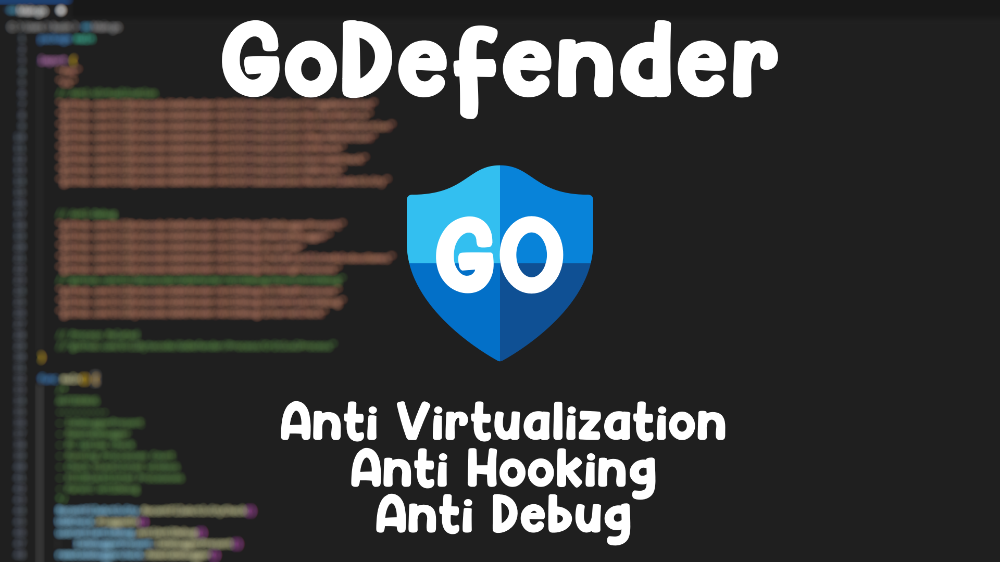

# Go Defender

## GoDefender

This Go package provides functionality to detect and defend against various forms of debugging tools and virtualization environments.
By the way, for quick setup, run `install.bat`.

### Anti-Virtualization

- **Triage Detection**: Detects if the system is running in a triage or analysis environment.
- **Monitor Metrics**: Monitors system metrics to identify abnormal behavior indicative of virtualization.
- **VirtualBox Detection**: Detects the presence of Oracle VirtualBox.
- **VMware Detection**: Detects the presence of VMware virtualization software.
- **KVM Check**: Checks for Kernel-based Virtual Machine (KVM) hypervisor.
- **Username Check**: Verifies if the current user is a default virtualization user.
- **Recent User Activity**: Checks user activity; if there are fewer than 20 files, it exits.
- **USB Mount**: Checks if a USB was ever plugged into the computer before.

### Anti-Debug

This module includes functions to detect and prevent debugging and analysis of the running process.

- **IsDebuggerPresent**: Checks if a debugger is currently attached to the process.
- **Remote Debugger**: Detects if a remote debugger is connected to the process.
- **PC Uptime**: Monitors system uptime to detect debugging attempts based on system restarts.
- **Check Blacklisted Windows Names**: Verifies if the process name matches any blacklisted names commonly used by debuggers.
- **Running Processes**: Retrieves a list of running processes and identifies potential malicious ones.
- **Parent Anti-Debug**: Detects if the parent process is attempting to debug the current process.
- **Kill Bad Processes**: Terminates known malicious processes detected on the system.
- **Detects Usermode AntiAntiDebuggers**: Detects user-mode anti-anti-debuggers like ScyllaHide (BASIC).
- **Internet Connection Check**: Checks if an internet connection is present.

### Process

This module focuses on critical processes that should be monitored or protected.

- **Critical Process**: Implements functionality to manage critical processes essential for system operation.
- **SeDebugPrivilege**: Grants better permissions.

### Quick Nutshell

- Detects most anti-anti-debugging hooking methods on common anti-debugging functions by checking for bad instructions on function addresses (most effective on x64). It also detects user-mode anti-anti-debuggers like ScyllaHide and can detect some sandboxes that use hooking to monitor application behavior/activity (like [Tria.ge](https://tria.ge/)).

## Credits

- https://github.com/AdvDebug: Inspired me to start making this package. Without him, it wouldn't be here. Check out his GitHub.
- https://github.com/MmCopyMemory: Provided ideas and much more. Check out his GitHub.
- I made this because I noticed someone was trying to crack or analyze my other Go programs. Previously, I had many lines of anti-debugging code (I coded lazily and put everything into one), so I wanted to create something quick and reliable that would make a reverse engineer's life harder. Thus, I made GoDefender.

### TODO (V1.0.6 Plans):
- Check Disk / RAM (If disk size is less than 100GB, exit; and if RAM size is less than 6GB, exit).
- Flags and artifacts.
- Execution time is lame, but I guess it can be added as well.
- Hiding threads through (NtSetInformationThread).
- Theres probably more, but i cant think of any right now.