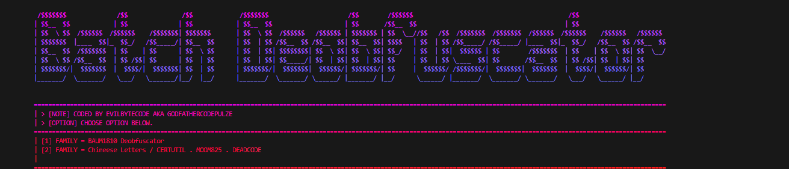

# Codepulze-Batchfile-Deobfuscator (MYSTIFIC)
- I made this beacuse i seen many payloads being made in batchfile, which are malicious and i wanted to do some malware analysis, and i wanted an automatized tool, so i made this for reverse engineers to simplify their life


<div align="center">
    
<div>             

# Discord: codepulze
         
- Golang Batchfile Deobfuscator, deobfuscate Chineese or Other Batchfile Methods.
- Made with ❤️ By Codepulze         

# Getting Started: 
- Install GoStyle Library:
```
go get github.com/MmCopyMemory/gostyle/pkg/gostyle
```
After do 
```
go run Deobfuscate.go
```

# [DEOBFUSCATION] Features 
- https://github.com/baum1810/batchobfuscator
- https://github.com/moom825/batch-obfuscator-made-in-python
- Can Deobfuscate ANY Chineese letters method.
- Example how Chineese letters i mean:
```
挦獬਍╀啰求捉縺㤸㠬┳倥䉕楌㩣㕾ㄬ䌥潈⁞景╞畐求䍉縺㘴ㄬ┶൦匊瑅删㵞杊╞啰䱂捉縺㌱ㄬ帥瑧塇╺啰䱂捉縺ⰴ┱╷啰䱂捉縺ㄱㄬ帥浨瀥䉕䥌㩣ㅾⰰ┱卞䡞幉幏ു帊瀥䉕䥬㩃ㅾⰴ┱䱞瀥䉕楬㩃㕾ⰵ㜱帥瀥扵䥬㩣㑾ㄬഥ䀊敞捞爥縺㔱ㄬ帥爥縺㜱ㄬ‥╞㩲ㅾⰷ┱൮䀊捥爥縺ㄱㄬ漥漠晦਍捥爥縺ㄱㄬ漥┠㩲ㅾⰱ┱汥潬┠㩲㥾ㄬ漥汲൤瀊╡㩲ㅾⰳ┱爥縺ⰸ┱൥┊㩲㡾ㄬ攥爥縺ⰴ┱愠㴠┠縥൩┊㩲㡾ㄬ攥爥縺ⰴ┱愠㴠┠⬠┠楾┢縥爥縺ⰲ┱┢਍敳⁴⁡‽愥ഥ㨊慡慡慡慡慡慡慡慡慡慡慡慡慡慡扡਍
```
- Also can deobfuscate:
```
::obfuscated by https://github.com/baum1810
@%TP%E%lTiV%c%UvhHojyQ%h%gXROkME%o%UB% %CQTpF%o%OdygZFcFXF%f%tWHneAr%f%iex%
e%ix%c%woJJQTdfW%h%GSbDSbsbwb%o%spweTvuzy% %wMDHYsY%h%Shn%i%wA%
e%GPRXtLmD%c%HVsgUoe%h%ciFdvqaOK%o%sI% %iif%g%ZDEYCkvg%o%uotmKQ%
e%rTdAazQ%c%UmLTKkaow%h%FtwEObR%o%vwSEMHOULh% %I%g%q%i%guC%h%NzEvLJAICt%i%gYCvPF%h%pDR%i%xumh%h%iFL%
p%aFtuZSqS%a%c%u%seQbJ%s%B%e%cYjyR%
```

## Want more features? 
- Pull an issue or PR and provide me obfuscators you want me to make automatized deobfucation for..


<div align="center">
    
<div>                     