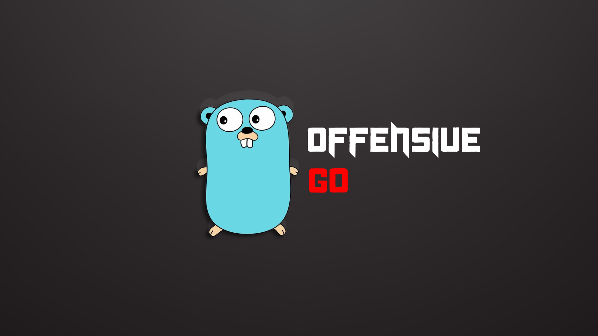

# GoRedOps



GoRedOps is a collection of Golang projects designed specifically for red teamers and offensive security operations. This repository provides various tools and techniques essential for penetration testing, exploitation, and security research.

## Table of Contents

- [About](#about)
- [Project Structure](#project-structure)
- [Getting Started](#getting-started)
- [Contributing](#contributing)

## About

GoRedOps aims to equip security professionals with the necessary tools to perform advanced security assessments. Each project is designed to address a specific aspect of red teaming, such as anti-debugging, process injection, cryptographic operations, and more.

## Project Structure

GoRedOps contains the following codes:

- **AntiDebugNOPACKAGE**
  - Anti-debugging techniques without packaging.
- **AntiDebugPackage**
  - Packaged anti-debugging techniques.
- **BatchfileDeobfuscator**
  - Tools for deobfuscating batch files.
- **CreateDLL**
  - Tools for creating dynamic-link libraries (DLLs).
- **crypto**
  - Various cryptographic algorithms (AES, ChaCha20, RC4, XOR).
- **EDR-XDR-AV-Killer**
  - Tools for evading and disabling EDR, XDR, and antivirus software.
- **ETWBypass**
  - Techniques for bypassing Event Tracing for Windows (ETW).
- **GoDLLInjector**
  - DLL injection techniques.
- **GoObfuscator**
  - Tools for obfuscating Go code.
- **injection_native_apc**
  - Native APC injection techniques.
- **injection_thread**
  - Thread injection techniques:
    - createThread
    - ntCreateThreadEx
- **instrumentation_callback**
  - Techniques involving instrumentation callbacks.
- **LifetimeAMSIBypass**
  - Bypassing AMSI (Antimalware Scan Interface).
- **misc**
  - Miscellaneous scripts and tools.
- **network**
  - Networking tools:
    - http (HTTP client and server)
    - pipes (Named pipes client and server)
    - tcp (TCP client and server)
- **ParentPIDSpoofing**
  - Techniques for spoofing parent process IDs.
- **PEParser**
  - Tools for parsing PE (Portable Executable) files.
- **process_dump**
  - Tools for dumping process memory.
- **ProtecProc**
  - Process protection techniques.
- **ProtectProcess**
  - Additional process protection techniques.
- **sandbox**
  - Techniques for detecting and evading sandboxes.
- **self_remove**
  - Tools for self-removing malware.
- **srdi**
  - Tools for shellcode reflection and dynamic invocation.
- **token**
  - Token manipulation tools:
    - impersonate
    - list
- **wmi**
  - Tools for interacting with Windows Management Instrumentation (WMI).

## Getting Started

To get started with any of the tools in this repository, navigate to the respective project directory and follow the instructions in the `README.md` file provided.

### Prerequisites

- Go programming language installed (version 1.20+)
- Knowledge of Golang and offensive security operations, so have a brain in nutshell.

### Installation

Clone the repository, and Change Dir to your specified one:

```bash
git clone https://github.com/EvilBytecode/GoRedOps.git
cd GoRedOps
cd desired_folder
```


### Contributing
- We welcome contributions to improve GoRedOps. If you have an idea for a new tool or an enhancement to an existing one, please fork the repository and submit a pull request.
### How to contribute?
- Steps to Contribute
- Fork the repository.
- Create a new branch for your feature or bug fix.
- Implement your changes and commit them with descriptive messages.
- Push your changes to your fork.
- Submit a pull request to the main repository.

# License : 
- NoLicense (UNLicense)

# Credits:
- https://github.com/Enelg52/OffensiveGo (40% projects Was taken off him, beacuse i didnt feel like writing an repeated process, if you want to take me down your repos contact me thanks)
